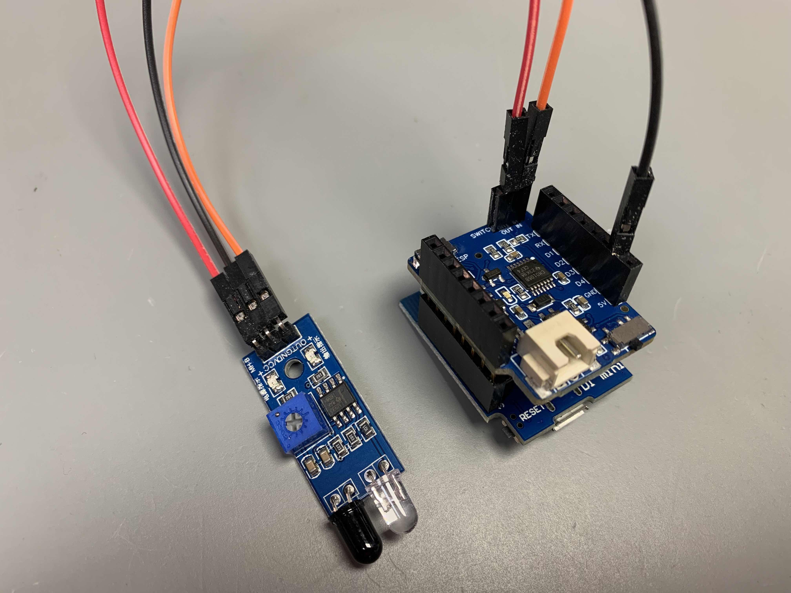

# Arduino Energy and Gas Meter Monitoring with a Wemos D1 Mini over MQTT

## Energy Meter
This is how your basic setup should look if you are using an IR Sensor breakout board to count each cycle:

```
RED - VIN - SWITCH_OUT (3V3)
BLACK - GND
ORANGE - SIGNAL - SWITCH_IN
```



## Gas Meter
### Setup A (Recommended for Battery Operation)
- **Reed switch** connected to SWITCH OUT/IN on a MicroWakeupper battery shield (stacked onto a Wemos D1 Mini).

### Setup B (External Power/USB)
- **Inductive proximity sensor LJ12A3-4-Z/BX 5V** connected with the signal line to SWITCH IN (common GND) on a MicroWakeupper battery shield (stacked onto a Wemos D1 Mini). The sensor typically consumes about 50mA (always on).

---

There are different gas meters in use, typically:
a) One with an internal magnet that turns each cycle—allowing the use of a reed switch for counting.
b) One with an internal metal plate that turns each cycle—allowing the use of a proximity sensor LJ12A3-4-Z/BX 5V.

Usually, one full rotation equals 0.01m³ (or 10 liters) of gas—check your gas meter for specifics.

The stacked MicroWakeupper shield turns your Wemos D1 Mini on and off. **Recommended:** Cut the onboard jumper J1.

**TL;DR:** The firmware counts each cycle, writes the total amount to EEPROM, and sends an MQTT message to your broker with the total amount of gas (total).

## Setup/Installation
1. Install the MicroWakeupper library [MicroWakeupper](https://github.com/tstoegi/MicroWakeupper) in your Arduino IDE.
2. Update the sketch file `config.h` with your custom setup.
3. Connect a Wemos D1 Mini (or Pro, with external antenna) via USB and upload the code. (If the MicroWakeupper shield is already stacked, press the onboard FLASH button during upload.)

   **OTA:** If the firmware is already installed, you can use OTA updates by setting (with retain) an MQTT message/value to `/settings/waitForOTA` with `true` once. OTA will be available for one minute.

**Warning:** As long as you power the Wemos via USB (or external VIN), the MicroWakeupper shield cannot turn it off.

All MQTT messages from the client (Wemos) are sent with the "retain" flag—so you see the last messages even if the device is off.

## FAQ
**Q: Where can I buy the MicroWakeupper battery shield?**  
A: [My store](https://www.tindie.com/stores/moreiolabs/)

**Q: How can I set an initial counter value?**  
A: Send/publish an MQTT message (with retain!) to `haus/gasmeter/settings/total`, e.g., `"202.23"`. After receiving that message, it is removed, and you should see the new value.

**Q: How can I install an OTA update (via Arduino IDE)?**  
A: Send/publish an MQTT message (with retain!) to `haus/gasmeter/settings/waitForOTA` with `"true"`. After receiving that message, it is removed, and you will see the OTA device named `[device_name]_[ip_address]`.

**Q: How can I adjust (calibrate) the battery voltage value?**  
A: Send/publish an MQTT message (with retain!) to `haus/gasmeter/settings/voltageCalibration`, e.g., `"+0.3"` or `"-0.5"` volts. The message has to stay there!

---

(c) 2022-2024 @tstoegi, Tobias Stöger, MIT License
